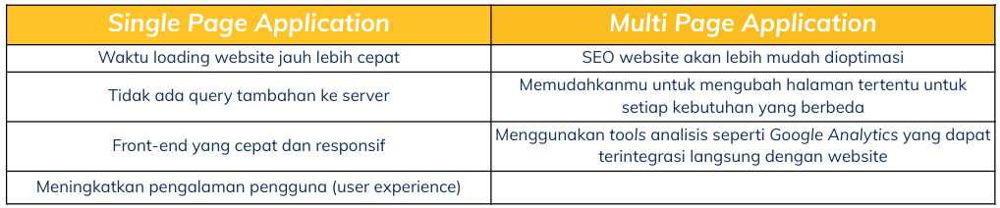
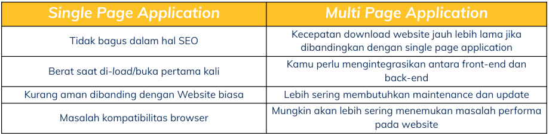

# Resume Materi KMReact – React Rputing

---

### MPA vs SPA

- **Multi Page Application**
  Multi Page Application merupakan jenis aplikasi website dimana saat pengguna mengganti routing dari laman, website tersebut akan memuat ulang seluruh halaman web
- **Single Page Application**
  Single Page Application merupakan jenis aplikasi website dimana hanya terdapat satu halaman website saja. Saat pengguna menganti routing dari laman, maka Javascript akan menangani pergantian komponen2 UI nya.
- **Keunggulan MPA dan SPA**
  
- **Kekurangan MPA dan SPA**
  

### React Router

React Router merupakan sebuah library dari ReactJs yang dapat kita gunakan untuk menggunakan router dalam aplikasi React kita. Kita dapat menginstall library ini melalui package manager yang kita gunakan.

Hal2 penting yang perlu dipahami untuk menggunakan React Router adalah sebagai berikut:

1. [createBrowserRouter](https://reactrouter.com/en/main/routers/create-browser-router)
2. [Route](https://reactrouter.com/en/main/route/route)
3. [Outlet](https://reactrouter.com/en/main/route/route)

Cara menggunakan React Router dapat dipelajari pada laman [ini](https://reactrouter.com/en/main/start/tutorial)

### Hook Routing

Terdapat beberapa hook yang dapat membantu kita dalam mengaplikasikan routing pada aplikasi React kita :

- **UseHistory**
  _useHistory_ memberi kita akses ke _instance_ riwayat yang dapat digunakan untuk melakukan navigasi
- **useParams**
  _useParams_ mengembalikan objek pasangan _key_ dan _value_ dari parameter URL.
- **useRouterMatch**
  _useRouterMatch_ mencoba mencocokkan URL saat ini dengan cara yang sama seperti `<Route/>`
