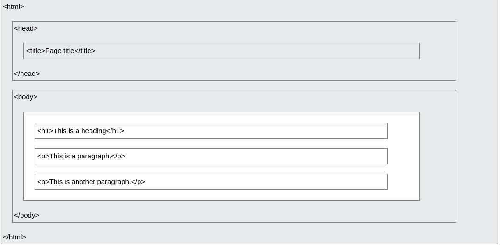

# Resume Materi KMReact – HTML

---

### Pengertian

Pada dunia _Web Development_, terdapat dua bidang utama dibalik terciptanya sebuah website, yaitu _Frontend_ dan _Backend_. _Frontend_ sendiri berfokus pada sisi _client_, sedangkan _backend_ berfokus pada sisi server. Jika seorang _web developer_ dapat melakukan keduanya, ia dapat disebut sebagai seorang _Fullstack Developer._

Seorang _Web Develpoer_, terlepas sebagai seorang _frontend_ atau _backend_, wajib menguasai tiga hal yaitu **HTML**, **CSS**, dan **Javascript**. Jika diibaratkan sebagai tubuh manusia, HTML berfungsi sebagai kerangka yang menjadi pondasi dasar tubuh, CSS berfungsi sebagai otot dan kulit yang menjadi tampilan visual dari luar, dan Javascript berfungsi sebagai otak yang menjadi penentu perilaku.

HTML sendiri merupakan singkatan dari _Hypertext Markup Language_. HTML dimanfaatkan sebagai standar yang digunakan secara luas untuk menampilkan sebuah _website_.

### Kegunaan

HTML memiliki beberapa kegunaan, antara lain:

1. Membuat struktur dari halaman _website_
2. Mengatur tampilan dan isi dari halaman web
3. Membuat tabel dengan tag HTML table
4. Membuat form HTML
5. Membuat gambar dengan canvas
6. Mempublikasikan halaman _website_ secara online

### Pengaplikasian

Sebuah elemen html dapat ditulis sebagai pasangan tag, sebuah konten, dan sebuah atribut opsional.
`<nama_tag nama_atribut="isi_atribut" > konten </nama_tag>`

Standar struktur file HTML dapat dibuat sebagai berikut:

beberapa tag dasar yang perlu diketahui:
`h1` s/d `h6` -> berfungsi untuk membuat judul\
`p` -> berfungsi untuk membuat paragraf\
`li` -> berfungsi untuk membuat sebuah list\
`ul` -> berfungsi untuk membuat poin dari list yang tidak berurut\
`ol` -> berfungsi untuk membuat poin dari list yang berurut\
`a` -> berfungsi untuk membuat sebuah link yang mengarah ke alamat lain\
`img` -> berfungsi untuk memasukkan sebuah gambar\
`button` -> berfungsi untuk membuat sebuah tombol\
`form` -> berfungsi untuk membuat sebuah form\
`input` -> berfungsi untuk membuat input/masukan dari sebuah form\
`label` -> berfungsi untuk membuat label dari sebuah input\
`table` -> berfungsi untuk membuat sebuah tabel\
